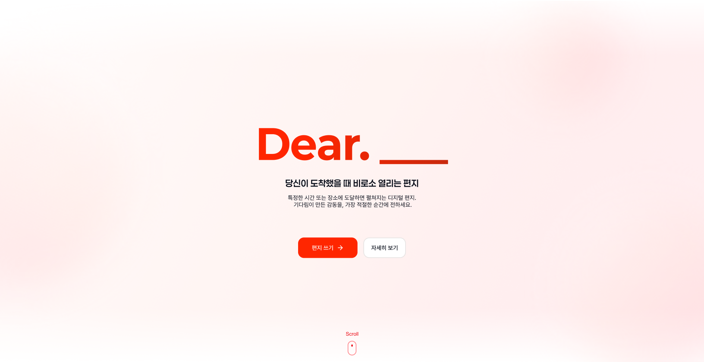
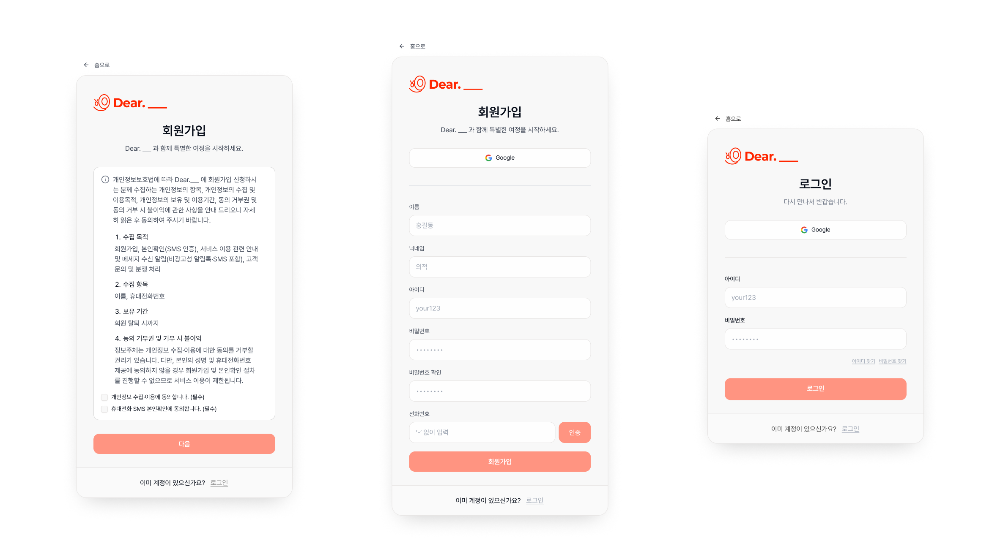
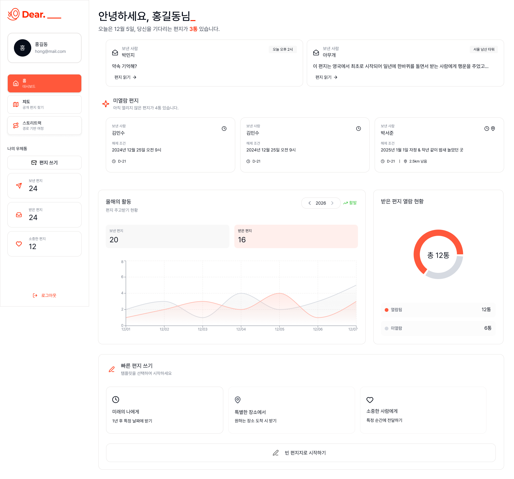
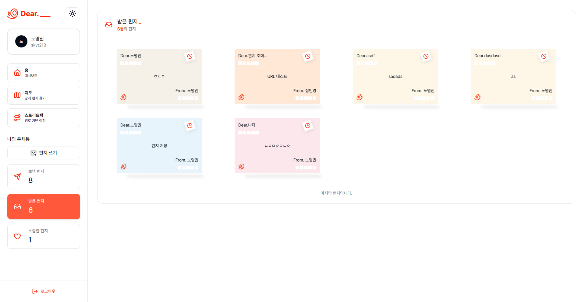
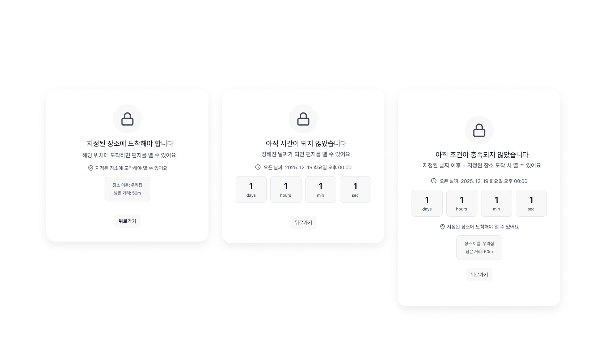
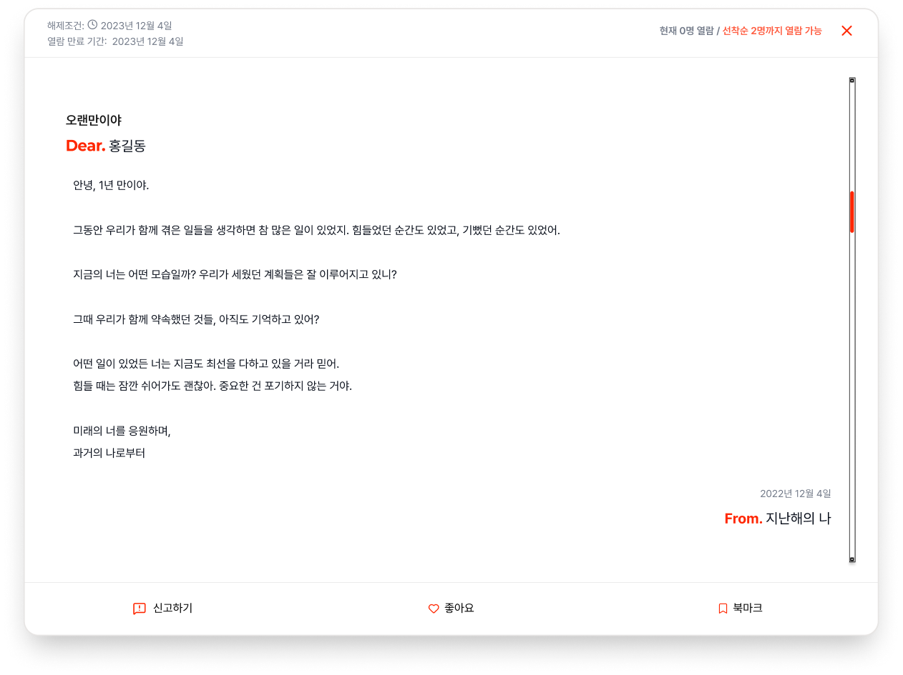
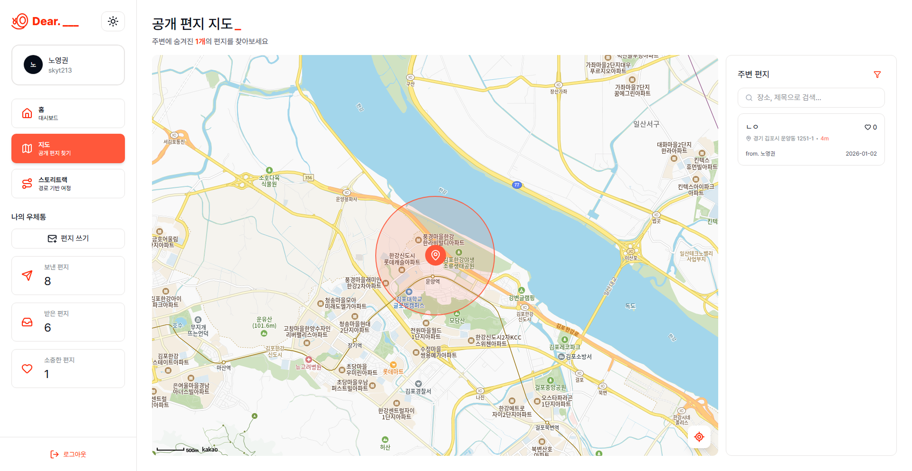
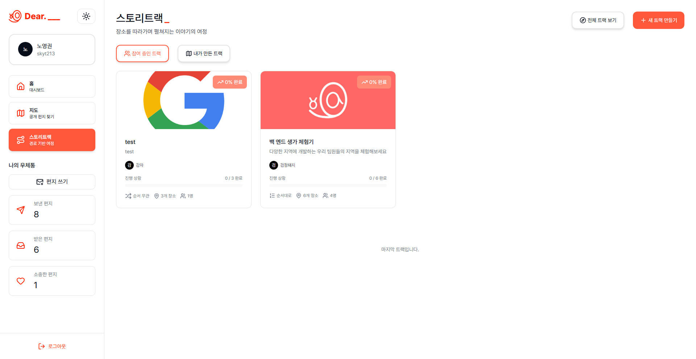
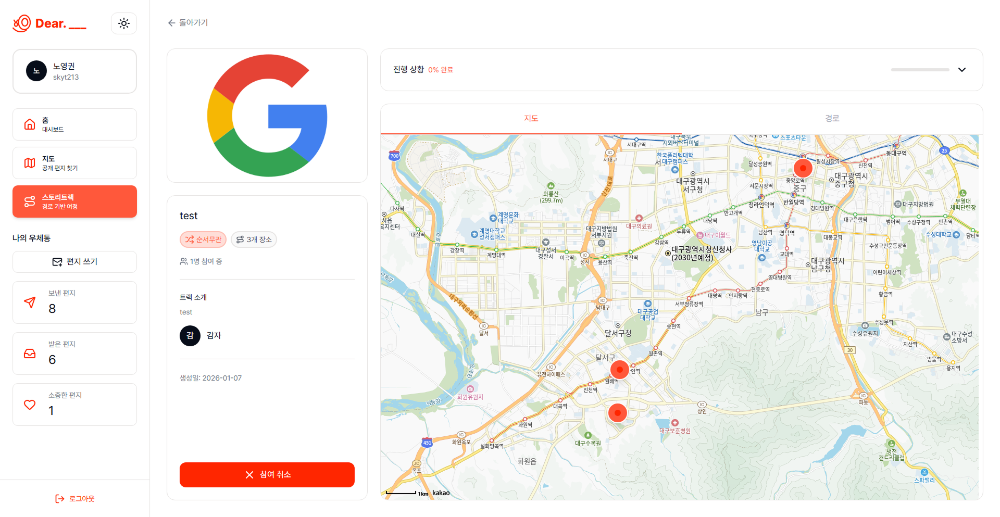

<div align="center">

<!-- logo -->


<br/>


</div>

## 📑 목차

- [프로젝트 소개](#-프로젝트-소개)
- [프로젝트 팀원](#-프로젝트-팀원)
- [주요 기능](#-주요-기능)
- [프로젝트 화면 구성](#-프로젝트-화면-구성)
- [사용한 기술 스택](#-사용한-기술-스택)
- [폴더 구조](#-폴더-구조)
- [시작하기](#-시작하기)

<br />

## 📮 프로젝트 소개

**Dear.\_\_\_** 는  
빠르게 전달되는 메시지보다, **도달해야 할 순간에 열리는 마음**에 집중한 시간·장소 기반 감성 편지 서비스입니다.

우리는 언제든 보낼 수 있는 메시지의 시대에 살고 있지만, 어떤 말들은 **지금이 아니라, 그때** 전해질 때 더 깊은 의미를 가집니다.  
Dear.\_\_\_는 사용자가 직접 정한 **날짜 또는 장소**에 도달해야만 열리는 편지를 통해 기다림이 감동으로 바뀌는 경험을 제공합니다.

편지에는

- 전하고 싶은 말
- 사진
- 그리고 그 순간의 감정

을 담을 수 있으며, 쉽게 꺼내지 못했던 이야기와 미뤄두었던 마음도 괜찮습니다.  
이 편지는 **지금의 당신을 그대로 기록해 두는 첫 걸음**입니다.

> **Real-time**이 주지 못하는 Right-time의 감동  
> "빠름"이 당연해진 시대, 진짜 특별함은 "적절한 순간에 도달하는 경험"에서 만들어집니다.

<br />

## 💁‍♂️ 프로젝트 팀원

|              Frontend(팀장)               |              Frontend(팀원)               |             Frontend(팀원)             |              Frontend(팀원)               |
| :---------------------------------------: | :---------------------------------------: | :------------------------------------: | :---------------------------------------: |
|   |   |   |   |
| [노영권](https://github.com/NohYeonggwon) | [김지호](https://github.com/RumPumpumpum) | [정민경](https://github.com/moming109) | [이상엽](https://github.com/Sangyeop1555) |

<br />

## ✨ 주요 기능

### 📍 GPS 기반 위치 해제

- **“여기에 도착해야 읽을 수 있어”**
- 실제 공간에 도달해야 열리는 편지로, 물리적 퀘스트 경험 제공

### 🧭 스토리트랙

- 여러 장소를 순회하며 순차적으로 열리는 연속 메시지
- 여행·데이트 경험을 하나의 **스토리**로 게임화
- 예시
  > _제주도 성산일출봉 → 월정리 해변 → 한라산 정상_  
  > 장소마다 열리는 연인의 메시지

### 🔒 개인 편지 (1:1 프라이빗 메시지)

- 연인 · 가족 · 친구에게 보내는 **오직 한 사람만을 위한 편지**
- 기념일, 여행의 특정 순간, 약속된 장소에서 열람
- 미래의 나에게 남기는 다짐과 기록
  - 목표를 이뤘을 때
  - 다시 돌아보고 싶은 순간에

### 🌍 공개 편지

- 관광지 · 명소에 남겨진 **익명의 메시지**
- 같은 장소에 도착한 사람만 발견할 수 있는 보물찾기 경험
- “이 장소에 온 당신에게”  
  → 같은 공간을 공유한 낯선 이와의 연결
- 인스타그래머블한 순간 수집 + 우연한 발견의 감동

### ⏰ 선착순 · 특정 시간 한정 편지

- 특정 시간 · 장소에 **동시에 도착한 사람만** 열람 가능한 이벤트성 콘텐츠
- 예시
  > _2025년 1월 1일 00:00_  
  > _광화문 광장 선착순 100명에게만 공개되는 신년 메시지_
- 실시간 커뮤니티 참여 욕구를 **제한된 경험의 가치**로 전환

<br />

## 🖥 프로젝트 화면 구성

### 🏠 홈 (랜딩 페이지)

<p align="center">
  
</p>

<p align="center">
서비스의 핵심 콘셉트인 <b>‘Right-time 메시지 경험’</b>을 소개하고,<br/>
전체 흐름을 직관적으로 전달하는 랜딩 화면입니다.
</p>

---

### 🔐 로그인 및 회원가입

<p align="center">
  
</p>

<p align="center">
로그인 및 회원가입을 통해 개인 계정을 생성하고,<br/>
편지과 스토리트랙을 안전하게 관리할 수 있습니다.
</p>

---

### 📊 대시보드 홈

<p align="center">
  
</p>

<p align="center">
편지(메시지·사진·감정)를 작성하고<br/>
열람 조건(시간·위치·공개 여부)을 설정해 편지을 생성합니다.
</p>

---

### 💌 대시보드 편지함

<p align="center">
  
</p>

<p align="center">
받은 편지, 보낸 편지, 즐겨찾기한 편지을<br/>
한눈에 확인하고 관리할 수 있는 편지함 화면입니다.
</p>

---

### 💌 편지 세부 (잠김/해제)

<p align="center">
  
  
</p>

<p align="center">
받은 편지, 보낸 편지, 즐겨찾기한 편지을<br/>
한눈에 확인하고 관리할 수 있는 편지함 화면입니다.
</p>

---

### 🗺️ 공개 편지

<p align="center">
  
</p>

<p align="center">
지도 기반으로 공개 편지을 탐색하고,<br/>
특정 장소에 도착했을 때만 열리는 메시지를 발견할 수 있습니다.
</p>

---

### 🧭 스토리트랙 목록

<p align="center">
  
</p>

<p align="center">
여러 장소를 순서대로 방문하며 이야기가 펼쳐지는<br/>
스토리트랙을 목록 형태로 확인할 수 있습니다.
</p>

---

### 📍 스토리트랙 세부 페이지

<p align="center">
  
</p>

<p align="center">
스토리트랙의 현재 진행 단계와 다음 목적지를 확인하며,<br/>
조건 충족에 따라 순차적으로 열리는 편지을 경험할 수 있습니다.
</p>

<br />

## 🛠 사용한 기술 스택

### 🎨 Front-end

#### 🧩 Language · Framework

<p>
  
  
  
</p>

#### 🔄 Data Fetching · Server State

<p>
  
  
</p>

#### 🎨 Styling · UI

<p>
  
  
  
</p>

#### 📝 Form · Validation

<p>
  
  
</p>

#### 🧭 Routing · Rendering

<p>
  
</p>

#### 📊 Charts · Visualization

<p>
  
</p>

---

### 🧰 Tools

<p>
  
  
  
  
</p>

<br />

## 📁 폴더 구조

```bash
src
├─ app/
│  ├─ layout.tsx                    # 전체 공통 레이아웃
│  ├─ page.tsx                      # 루트 페이지
│  ├─ not-found.tsx                 # 404 에러 페이지
│  ├─ providers.tsx                 # 전역 Provider
│  │
│  ├─ (admin)/
│  │   └─ admin/                    # 관리자 전용 페이지
│  │       ├─ capsules/             # 편지 관리
│  │       ├─ moderation-logs/      # 관리/제재 로그
│  │       ├─ phone-verifications/  # 휴대폰 인증 관리
│  │       ├─ reports/              # 신고 관리
│  │       └─ users/                # 사용자 관리
│  │
│  ├─ (auth)/
│  │   └─ auth/                     # 인증 관련 페이지
│  │       ├─ account-recovery/     # 계정 찾기 / 비밀번호 복구
│  │       ├─ login/                # 로그인
│  │       ├─ profile/              # 프로필 설정
│  │       └─ register/             # 회원가입
│  │
│  └─ (users)/
│       ├─ capsules/                # 사용자 편지 관련 페이지
│       │   ├─ [uuid]/              # 편지 상세 페이지
│       │   ├─ edit/                # 편지 수정
│       │   └─ new/                 # 편지 생성
│       │
│       └─ dashboard/               # 사용자 대시보드
│           ├─ (mailbox)/           # 편지함 영역
│           │   ├─ bookmark/        # 즐겨찾기한 편지
│           │   ├─ receive/         # 받은 편지
│           │   └─ send/            # 보낸 편지
│           │
│           ├─ map/                 # 지도 기반 편지 탐색
│           └─ storyTrack/          # 스토리트랙 기능
│               ├─ [trackId]/       # 스토리트랙 상세
│               ├─ all/             # 전체 스토리트랙
│               ├─ joined/          # 참여 중인 스토리트랙
│               ├─ mine/            # 내가 생성한 스토리트랙
│               └─ new/             # 스토리트랙 생성
│
├─ components/
│  ├─ auth/                         # 인증 관련 컴포넌트
│  ├─ capsule/                      # 편지 관련 컴포넌트
│  ├─ common/                       # 공통 재사용 컴포넌트
│  │   ├─ Button/                   # 버튼 컴포넌트
│  │   ├─ modal/                    # 모달 컴포넌트
│  │   ├─ theme/                    # 테마 관련 컴포넌트
│  │   └─ ...
│  │
│  ├─ dashboard/                    # 대시보드 UI 컴포넌트
│  │   ├─ admin/                    # 관리자 대시보드 UI
│  │   ├─ contents/                 # 대시보드 콘텐츠 영역
│  │   ├─ map/                      # 공개 편지 관련 지도 UI
│  │   ├─ sidebar/                  # 사이드바
│  │   └─ storyTrack/               # 스토리트랙 UI
│  │
│  ├─ landingPage/                  # 랜딩 페이지 UI
│  └─ ui/                           # 공통 UI 컴포넌트(shadcn/ui)
│      ├─ shadcn/
│      └─ skeleton/                 # 로딩 스켈레톤
│
├─ lib/
│  ├─ api/                          # API 요청 모듈
│  │   ├─ admin/                    # 관리자 API
│  │   ├─ auth/                     # 인증 API
│  │   ├─ capsule/                  # 편지 API
│  │   ├─ dashboard/                # 대시보드 API
│  │   └─ ...
│  │
│  ├─ constants/                    # 상수 정의
│  ├─ hook/                         # 공통 커스텀 훅
│  └─ kakao/                        # 카카오 지도/SDK 관련 로직
│
├─ types/                           # 전역 TypeScript 타입 정의
│
└─ css/                             # 전역 스타일 및 Tailwind 설정
```

## 시작하기

```bash
# 1. 프로젝트 클론
git clone https://github.com/prgrms-web-devcourse-final-project/WEB6_7_FullChamZal_FE.git

# 2. 프로젝트 디렉토리 이동
cd WEB6_7_FullChamZal_FE

# 3. dev 브랜치로 이동
git checkout dev

# 4. 의존성 설치
npm install
# 또는
# yarn
# 또는
# pnpm install

# 5. 환경 변수 파일 생성
touch .env.local

# 6. 환경 변수 설정
# NEXT_PUBLIC_API_BASE_URL=
# NEXT_PUBLIC_KAKAOMAP_KEY=3923a92cd5c7731fe38af11940a10bc3

# 7. 개발 서버 실행
npm run dev

# 8. 브라우저 접속
# http://localhost:3000

# 9. 프로덕션 빌드
npm run build

# 10. 프로덕션 서버 실행
npm run start


```
